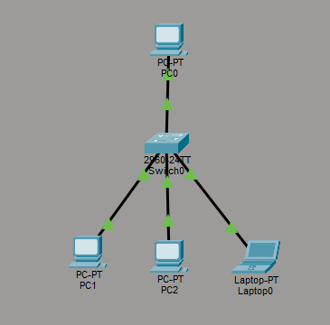
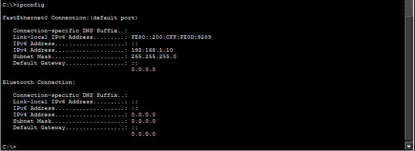
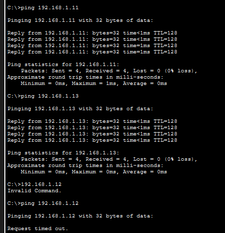

# 01 - LAN Fundamentals

## Objective

Build a basic Local Area Network (LAN) using Cisco Packet Tracer and validate communication between hosts.

---

## Topology

---

## Devices

- 1 Cisco Switch
- 3 PCs

---

## IP Configuration

| Device | IP Address | Subnet Mask |
|---------|------------|-------------|
| PC0 | 192.168.1.10 | 255.255.255.0 |
| PC1 | 192.168.1.11 | 255.255.255.0 |
| PC2 | 192.168.1.12 | 255.255.255.0 |

---

## Connectivity Test

The communication between all hosts was validated using the `ping` command.

---

## Troubleshooting

During the initial configuration, one host was mistakenly configured with the IP address `192.186.1.13`.

Because it belonged to a different network, communication failed.

After correcting the address to `192.168.1.12`, connectivity was successfully restored.

---

## Concepts Practiced

- IPv4 Addressing
- Subnet Mask
- Basic LAN
- ICMP (Ping)
- Basic Troubleshooting
